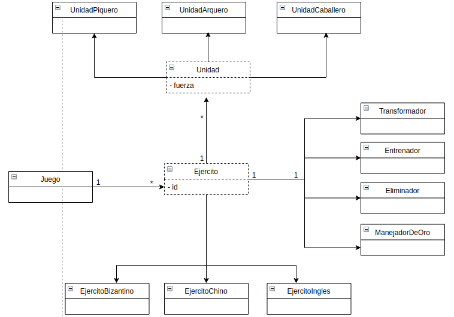

###Ejercicio para entrevista en empresa Amalgama

####Lenguaje utilizado: Java 8

####Diagrama de clases:

####Decisiones de implementación:

* Si una batalla resulta en empate, ambos ejércitos pierden su unidad más valiosa.
* Una misma unidad puede ser entrenada una cantidad ilimitada de veces, a menos que no se tenga oro suficiente.
* Una misma unidad puede ser transformada hasta dos veces, porque un Caballero ya no puede transformarse.
* Si se intenta transformar un caballero, se lanza un error.
* Si se intenta entrenar o transformar más unidades de las disponibles, se lanza un error.
* Si al intentar entrenar o transformar unidades, se supera la cantidad de oro disponible, se lanza un error.

Faltantes:

* Quedaron pendientes algunas pruebas de integración del modelo (principalmente, en la clase Juego).
